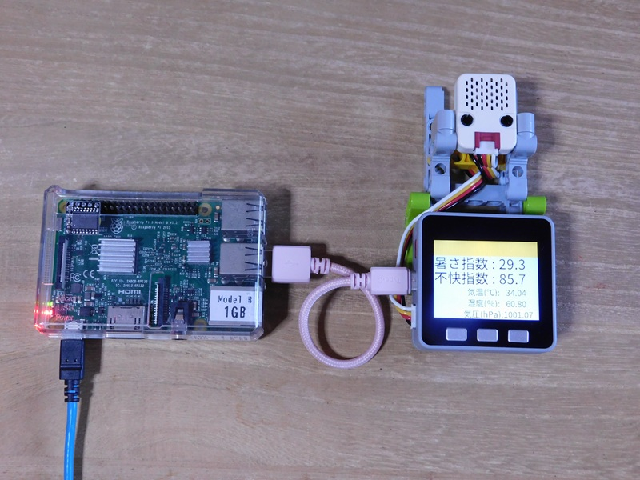

# WBGT monitor

暑さ指数計測システム

## 概要  
M5Stack社 のM5Stack gray と温湿度センサーユニットで、暑さ指数(WBGT)を記録するシステムを作成した。 
温湿度の測定は、すでにArduino-IDE(C++)やPythonなどで開発された多くのサンプルや事例が公開されている。  
今回、なぜ、この様なシステムを作成したのか？
理由は以下のとおりである。

1. 今年６月より、労働安全衛生規則の改正により、職場での熱中症対策が義務化され、作業環境の暑さ指数を測定し、リスクを評価する必要になった。  
職場や自宅で、適正に温湿度管理ができているかを調べたい。    
2. 最近、学んだTinygoで、dどこまで実用的なシステムが構築できるか試してみた。  

結論としては、M5Stack では、tinygoでサポートされていない機能等や制約があった。それを補完するため、Raspberry Piを併用して必要最低限の機能を実装することができた。  

## ハードウェア

* M5Stack社 [M5Stack gray](https://docs.m5stack.com/ja/core/gray)
* M5Stack社 [ENV IV Unit](https://docs.m5stack.com/ja/unit/ENV%E2%85%A3%20Unit)  
  Temperature Humidity Air Pressure Sensor (SHT40+BMP280)
* raspberrypi財団 [Raspberry Pi 3 Model B](https://www.raspberrypi.com/products/raspberry-pi-3-model-b/)  

{width=50%}
システム構成図  

システムの外観

WBGT 測定ユニット

## ソフトウェア

* [tinygo](https://tinygo.org) version 0.38.0  
M5Stackのプログラム開発に使用
* [go](https://go.dev/) version go1.24.5 and LLVM version 19.1.2  
Raspberry pi側のプログラム開発に使用

## 開発したアプリ

### [WBGT_watcher](./WBGT_watcher/readme.md) 

M5Stack+温湿度センサーを制御し、一定時間毎に温度、湿度、気圧を測定する。
測定結果から、暑さ指数(WBGT)、不快指数(THI)を算出して、一定時間毎に結果をシリアルに出力する。
開発にはTinygoを使用した。  
[WBGT_watcher](./WBGT_watcher/readme.md) へ

### [serial_logger](./serial_logger/readme.md) 

[Raspberry Pi 3 Model B](https://www.raspberrypi.com/products/raspberry-pi-3-model-b/)上で動作するロギング用のアプリ
機能は、シリアルポートを監視し、WBGT_watcherから送られてくる測定データを受取り、受信した日時を加えて、CSVファイルとして保存するだけの単純なものである。  
開発にはGo言語を使用した。  
[serial_logger](./serial_logger/readme.md) へ

## ライセンス

お粗末なコードではあるが、[Poul-Henning Kamp](https://people.freebsd.org/%7Ephk/) 氏が提唱しているBEER-WAREライセンスを踏襲し配布する。  

### "THE BEER-WARE LICENSE" (Revision 42)

<akio@triring.net> wrote this file. As long as you retain this notice you
can do whatever you want with this stuff. If we meet some day, and you think this stuff is worth it, you can buy me a beer in return.
Copyright (c) 2024 Akio MIWA @triring  

### "THE BEER-WARE LICENSE" (第42版)

このファイルは、<akio@triring.net> が書きました。あなたがこの条文を載せている限り、あなたはソフトウェアをどのようにでも扱うことができます。
もし、いつか私達が出会った時、あなたがこのソフトに価値があると感じたなら、見返りとして私にビールを奢ることができます。  
Copyright (c) 2024 Akio MIWA @triring  

