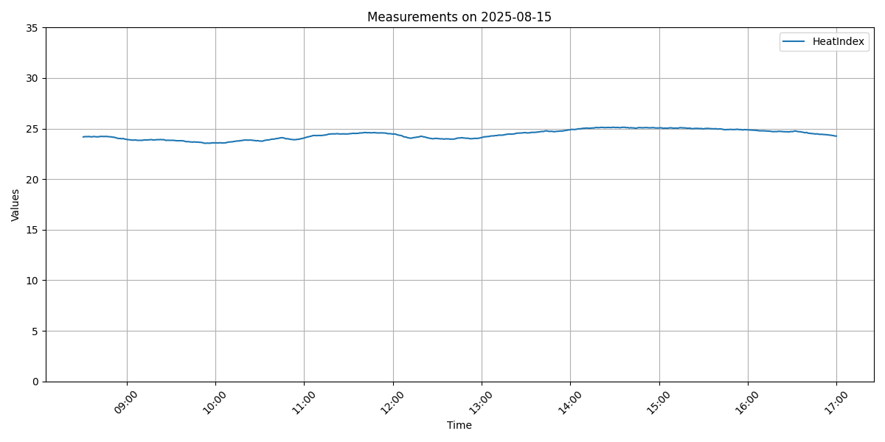
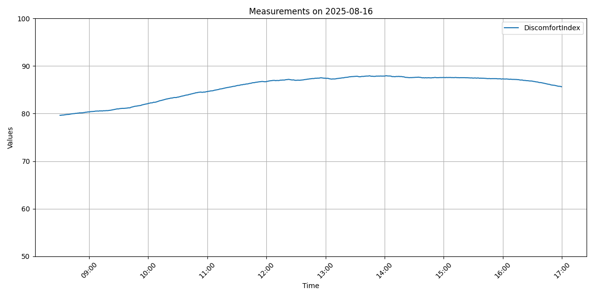
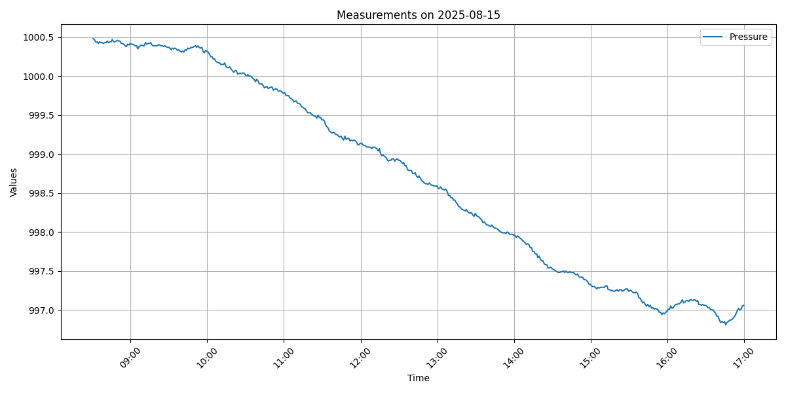

# WBGT monitor

暑さ指数計測システム

## 概要  
M5Stack社 のM5Stack gray と温湿度センサーユニットで、暑さ指数(WBGT)を記録するシステムを作成した。 
温湿度の測定は、すでにArduino-IDE(C++)やPythonなどで開発された多くのサンプルや事例が公開されている。  
今回、なぜ、この様なシステムを作成したのか？
理由は以下のとおりである。

1. 今年６月より、労働安全衛生規則の改正により、職場での熱中症対策が義務化され、作業環境の暑さ指数を測定し、リスクを評価する必要になった。  
職場や自宅で、適正に温湿度管理ができているかを調べたい。    
2. 最近、学んだTinygoで、dどこまで実用的なシステムが構築できるか試してみた。  

結論としては、M5Stack では、tinygoでサポートされていない機能等や制約があった。それを補完するため、Raspberry Piを併用して必要最低限の機能を実装することができた。  

## ハードウェア

* M5Stack社 [M5Stack gray](https://docs.m5stack.com/ja/core/gray)
* M5Stack社 [ENV IV Unit](https://docs.m5stack.com/ja/unit/ENV%E2%85%A3%20Unit)  
  Temperature Humidity Air Pressure Sensor (SHT40+BMP280)
* raspberrypi財団 [Raspberry Pi 3 Model B](https://www.raspberrypi.com/products/raspberry-pi-3-model-b/)  


  
システムの外観  

## ソフトウェア

* [tinygo](https://tinygo.org) version 0.38.0  
  M5Stackのプログラム開発に使用  
* [go](https://go.dev/) version go1.24.5 and LLVM version 19.1.2  
  Raspberry pi側のプログラム開発に使用  

## 開発したアプリ

### [WBGT_watcher](./WBGT_watcher/readme.md) 

M5Stack+温湿度センサーを制御し、一定時間毎に温度、湿度、気圧を測定するシステムをtinygoで開発した。  
測定結果から、暑さ指数(WBGT)、不快指数(THI)を算出して、一定時間毎に結果をシリアルに出力する。また、液晶の表示を更新を行う。  
[WBGT_watcher](./WBGT_watcher/readme.md) へ

### [serial_logger](./serial_logger/readme.md) 

[Raspberry Pi 3 Model B](https://www.raspberrypi.com/products/raspberry-pi-3-model-b/)上で動作するロギング用のアプリ機能は、シリアルポートを監視し、WBGT_watcherから送られてくる測定データを受取る。
そのデータに、受信した日時を加えて、CSVファイルとして保存するだけの単純なものである。  
開発にはGo言語を使用した。  
[serial_logger](./serial_logger/readme.md) へ

## 運用結果

今回、開発したシステムで、Raspberry Pi のcronを設定し、測定ユニットから送られてくる温湿度等をcsv形式で記録した。  

```bash
2025-08-08,09:00:15,27.10,64.67,989.17,23.54,76.35
2025-08-08,09:01:16,27.09,64.57,989.20,23.53,76.33
2025-08-08,09:02:16,27.09,64.47,989.20,23.52,76.32
2025-08-08,09:03:16,27.12,64.35,989.21,23.53,76.34
2025-08-08,09:04:15,27.10,64.22,989.23,23.50,76.29
2025-08-08,09:05:15,27.10,64.15,989.24,23.49,76.28
2025-08-08,09:06:15,27.09,64.04,989.25,23.47,76.26
2025-08-08,09:07:16,27.10,64.03,989.26,23.48,76.27
2025-08-08,09:08:16,27.10,63.93,989.27,23.47,76.26
2025-08-08,09:09:15,27.11,63.81,989.28,23.46,76.26
2025-08-08,09:10:15,27.09,63.75,989.26,23.44,76.22
2025-08-08,09:11:15,27.09,63.73,989.27,23.43,76.22
2025-08-08,09:12:16,27.07,63.57,989.26,23.40,76.18
2025-08-08,09:13:16,27.07,63.46,989.27,23.39,76.16
2025-08-08,09:14:16,27.08,63.48,989.27,23.40,76.18
2025-08-08,09:15:15,27.10,63.47,989.28,23.42,76.21
2025-08-08,09:16:15,27.11,63.38,989.28,23.42,76.21
2025-08-08,09:17:15,27.14,63.29,989.28,23.43,76.24
2025-08-08,09:18:16,27.15,63.22,989.30,23.44,76.25
2025-08-08,09:19:16,27.19,63.10,989.30,23.46,76.28
2025-08-08,09:20:16,27.16,62.99,989.31,23.42,76.23
```

## [収集データのグラフ化](plot/readme.md)

収集データはpythonで加工し、グラフ化した。以下の一連の図は、その一例で、空調が効いている平日と空調が停止している休日のデータをグラフ化したものである。  
このグラブ描画スクリプトは、以下のディレクトリで公開している。  
[plot/readme.md](plot/readme.md)

### 温湿度変化
  
[平日](plot/Temperature_Humidity20250815.png)
  
[休日](plot/Temperature_Humidity20250816.png)

### 暑さ指数
  
[平日](plot/HeatIndex20250815.png)  
  
[休日](plot/HeatIndex20250816.png)  

### 不快指数
  
[平日](plot/DiscomfortIndex20250815.png)  
  
[休日](plot/DiscomfortIndex20250816.png)  

### 気圧変化
  
[平日](plot/Pressure20250815.png)  
  
[休日](plot/Pressure20250816.png)  

このシステムで、1週間ほど連続運用しているが、現在のところ、安定して稼働している。  

## 今後の課題

最初は、M5Stack＋温湿度センサーだけで、システムを構築できると考えて開発を始めた。
しかし、以下のような問題があったので、これらの足りない機能を補うためにRaspberry Piを併用してシステムを実装することになった。  

* tinygoでは、SPIの機能はサポートされているが、M5StackのSDカードの読み書きはできなかった。  
M5Stackでは液晶とSDカードが同じSPIのラインに接続されおり、適宜、切り替えながらアクセスすることが必要なようだ。
* tinygoでは、M5StackのWiFiやBluetooth機能がサポートサれていなかった。
* 時刻管理に必要なRTCが使えなかった。I2CにRTCを接続すると、同じくI2C接続の温湿度センサーと競合するのか、正常に機能しなかった。
(アドレスは競合していなかった。通信速度等の設定が問題かもしれない。)

tinygoでのM5Stackのサポート状況は、まだ、発展途上なので、これらも問題も徐々に改善されていくと思われる。

https://tinygo.org/docs/reference/microcontrollers/m5stack/

今後、tinygoで、上記の問題を解決する機能が追加されれば、それらをこのシステムに取り込みながら、少しづつ改良を続けていく予定である。  

## ライセンス

お粗末なコードではあるが、[MIT License](./LICENSE) と BEER-WAREのデュアルライセンスとして配布する。  

BEER-WAREとは、[Poul-Henning Kamp](https://people.freebsd.org/%7Ephk/) 氏が提唱したライセンスである。  

### "THE BEER-WARE LICENSE" (Revision 42)

<akio@triring.net> wrote this file. As long as you retain this notice you
can do whatever you want with this stuff. If we meet some day, and you think this stuff is worth it, you can buy me a beer in return.
Copyright (c) 2025 Akio MIWA @triring  

### "THE BEER-WARE LICENSE" (第42版)

このファイルは、<akio@triring.net> が書きました。あなたがこの条文を載せている限り、あなたはソフトウェアをどのようにでも扱うことができます。
もし、いつか私達が出会った時、あなたがこのソフトに価値があると感じたなら、見返りとして私にビールを奢ることができます。  
Copyright (c) 2025 Akio MIWA @triring  
