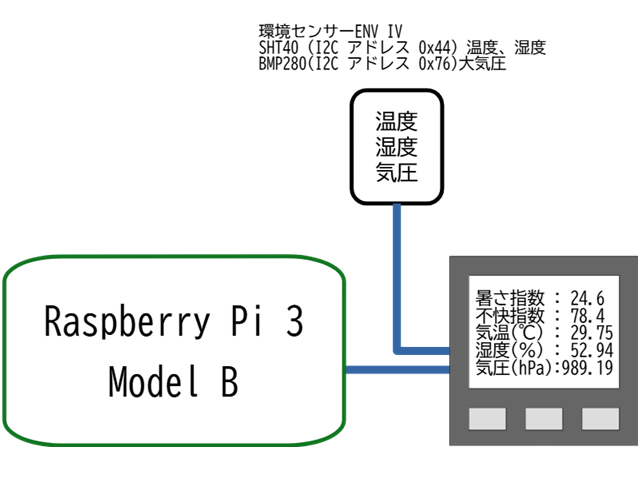

# serial_logger

シリアルからの入力を監視し、受け取った文字列の先頭に、受信した日付と時刻を加えて、コンソールへの表示とログファイルへの追記を行う。  
以下のように構成されたシステムで、Raspi上でこのプログラムを実行し、計測ユニットから、定期的に送られてくる計測データを記録していくために、go言語で作成した。  

{width=50%}  
システム構成図  

  
システムの外観  


## コンパイル

``` bash
$ go build -o serial_logger main.go
```

## 実行

``` bash
./serial_logger [options]
```

* -baud オプションでボーレートを受け取る (デフォルト値: 115200)
* -file オプションで出力ファイル名を受け取る (デフォルト値: serial_log.txt)
* -port シリアルポート名を指定する。 (デフォルト値: /dev/ttyUSB0)

## 使用例

``` bash
$ ./serial_logger -baud 115200 -port /dev/ttyUSB0 -file WBGT`date "+%Y%m%d"`.csv
```

上記は、Raspberry Pi上で使用することを想定した起動例である。

* シリアルポート/dev/ttyUSB0を監視する。
* 通信速度は、115200 bps に設定する。
* シリアルから送られてくる計測データは、その日の日付を埋め込んだファイルにCSV形式で追記していく。
